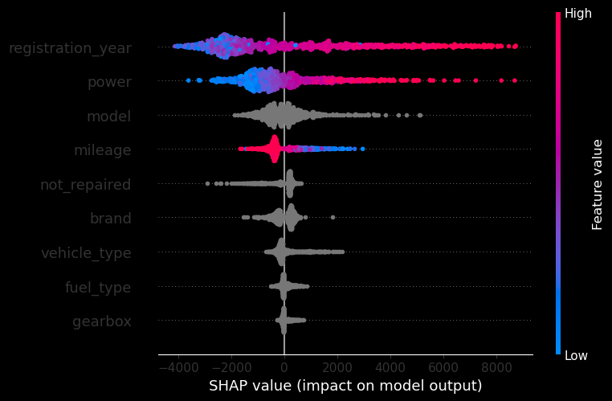
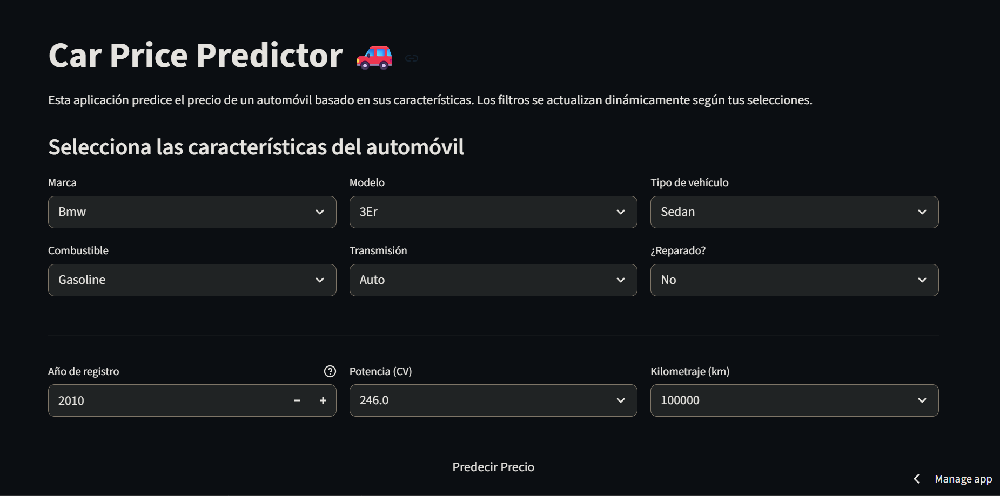

# 🚗 Valuación Automatizada de Vehículos con Machine Learning
> **Enfoque del Rol:** Machine Learning Engineer / Data Scientist

[](https://car-price-predictor-app-ml.streamlit.app/)
[](https://github.com/DavidVaAc/car-price-regressor/blob/main/notebooks/car_price_regressor.ipynb)

---

### 🎯 1. El Desafío (The Challenge)
* **¿Qué problema estaba resolviendo?** Las empresas de compraventa de vehículos usados dependen de tasaciones manuales lentas, costosas y propensas a errores humanos, lo que limita su capacidad para escalar operaciones en plataformas digitales.

* **¿Por qué importa?** Una cotización errónea puede costar miles de euros en pérdidas operativas (comprar muy caro) o pérdida de clientes (ofrecer muy poco). El negocio requería automatizar la tasación mediante un servicio web rápido, estable y con un margen de error estrictamente controlado.

* **Objetivo de negocio:** Desarrollar un modelo predictivo con un error promedio (RMSE) **menor a 2,500 €** sobre datos nunca antes vistos, con una latencia de respuesta instantánea para el usuario final y un coste mínimo de mantenimiento e infraestructura.

---

### 🔬 2. El Proceso End-to-End (The Process)

Seguí un flujo de trabajo científico completo e integral, estructurado en las siguientes fases:

#### A. Auditoría y Curación de Datos (Data Engineering)
El conjunto de datos original (proveniente de un *scraping* del mercado automotriz alemán) presentaba un alto nivel de ruido estructural:
* **Filtros Físicos:** Eliminé registros con precios equivalentes a cero, potencias imposibles (0 CV o > 1,000 CV) y años de registro fuera del rango de cobertura real (fijando una ventana operativa fiable de 1990 a 2015).

* **Imputación Localizada Integrada:** En lugar de eliminar filas con valores nulos en variables clave (`vehicle_type`, `gearbox`, `fuel_type`), programé una lógica que imputa el valor utilizando la moda/mediana del **mismo modelo y marca específica**, rescatando miles de registros sin corromper la distribución estadística original.

* **Validación Post-limpieza por Promedios Agrupados:** Un segundo barrido de validación detectó dos *buckets centinela* del formulario original que pasaban inadvertidos en el `pairplot`:

    * `registration_year == 2016` (año de borde mal poblado, mezcla coches genuinos con valores por defecto del scraper).
    * `mileage == 5000` (valor mínimo del selector, contaminado por usuarios que no informaron el kilometraje real).

    Ambos buckets se eliminaron, dejando las relaciones marginales precio↔año y precio↔kilometraje monótonamente coherentes con la lógica del mercado.

* **Optimización de Infraestructura:** Apliqué un casting explícito a las variables de tipo texto a formato `category` de Pandas y persistí el dataset depurado en formato binario **Apache Parquet**, reduciendo el peso de almacenamiento y acelerando los tiempos de lectura/escritura en producción.

#### B. Estrategia de Validación Declarada
Para garantizar la solidez científica del experimento y prevenir el sobreajuste (*overfitting*), apliqué la siguiente estrategia antes de entrenar cualquier algoritmo:
1. División inicial estricta de datos en **80% Entrenamiento y 20% Prueba (Test ciego)**.
2. Optimización de hiperparámetros mediante **GridSearchCV con Validación Cruzada de 5 Folds** ejecutada exclusivamente sobre el conjunto de entrenamiento.

#### C. Decisiones Clave & Evaluación de Algoritmos (Trade-offs)
Seis arquitecturas compitieron bajo idénticas condiciones de validación, adaptando el preprocesamiento (como *Target Encoding* y codificación nativa) a las necesidades específicas de cada modelo:

| Modelo | RMSE (Test Ciego) | Tiempo de Entrenamiento | Latencia de Inferencia | Veredicto & Trade-off |
|---|---|---|---|---|
| 🥇 **LGBMRegressor** | **~1,592 €** | **~1.8 s** | **~0.09 s** | **✅ Seleccionado:** El mejor balance entre precisión, reentrenamiento ágil y respuesta instantánea. |
| 🥈 XGBRegressor | ~1,594 € | ~3.3 s | ~0.26 s | ⚠️ Cumple en error, pero es casi 3 veces más lento al predecir. |
| 🥉 CatBoostRegressor | ~1,634 € | ~12.2 s ⚠️ | ~0.05 s | ⚠️ Excelente latencia, pero el coste de cómputo en entrenamiento es inviable. |
| RandomForestRegressor | ~1,625 € | ~14.4 s ⚠️ | ~1.15 s ⚠️ | ❌ Descartado: Latencia masiva de más de 1 segundo en producción. |
| DecisionTreeRegressor | ~1,879 € | ~0.8 s | ~0.05 s | ⚠️ Rápido, pero propenso a inestabilidad. |
| 🛑 LinearRegression | > 2,800 € | ~0.5 s | ~0.06 s | **❌ Línea Base (Baseline):** Incapaz de capturar la complejidad del problema. |

---

### 📊 3. El Resultado e Impacto de Negocio (The Result)

* **Línea Base vs. Selección Final:** El modelo basado en gradiente **LightGBM** demolió a nuestro baseline de Regresión Lineal, reduciendo el error en más de 1,200 € y demostrando que la depreciación de un vehículo no sigue un patrón lineal.

* **Métricas en Lenguaje Sencillo (¿Qué significan los números?):**
    * El modelo final logró un **RMSE de ~1,592 €**. Esto significa que, en promedio, el sistema se equivoca por menos de la quincena del valor real del coche, situándose **908 € por debajo del límite estricto** exigido por el negocio.
        
    * El coeficiente **R² de ~0.87** confirma que el modelo es capaz de explicar el 87% de la variabilidad del precio de los autos basándose únicamente en sus características técnicas.

    * Con una latencia de **0.09 segundos**, el modelo responde de forma imperceptible para el usuario en la web, consumiendo apenas **1.8 segundos para reentrenarse** por completo ante cambios de mercado.

#### 🧠 Interpretabilidad del Modelo (SHAP)
Utilizando `shap.TreeExplainer`, se auditó el comportamiento interno del algoritmo para garantizar que no existieran sesgos extraños. La triada **`registration_year` (antigüedad) × `power` (potencia) × `mileage` (desgaste)** concentra el 80% del peso de las decisiones, alineándose perfectamente con la lógica económica real de la industria automotriz.

<p align="center">
  
</p>

---

### 🛡️ 4. Análisis de Errores y Limitaciones de la Aplicación

Ningún modelo es perfecto. Identificar sus límites es lo que asegura su estabilidad:
* **Fallas conocidas (Out-of-Domain):** El modelo pierde precisión con vehículos ultra raros, autos modificados (tuning) o vehículos clásicos/vintage anteriores a 1990, ya que el grueso de la distribución de entrenamiento se concentra en modelos comerciales de uso diario.

* **Blindaje en la Interfaz (UI):** Para mitigar estas limitaciones y evitar el riesgo de "Datos basura" (*Garbage In, Garbage Out*), diseñé en Streamlit un sistema de **filtros dinámicos en cascada**. Si el usuario selecciona una marca, los selectores posteriores se restringen automáticamente para mostrar solo los modelos y transmisiones que existieron físicamente en el histórico, haciendo imposible que el usuario envíe una combinación inexistente al modelo.

<p align="center">
  
</p>

---

### 🛠️ 5. Tecnologías y Reproducibilidad

* **Core ML:** Python, LightGBM, XGBoost, CatBoost, Scikit-Learn, Category Encoders, SHAP, Joblib.
* **Data Engineering:** Pandas, NumPy, PyArrow (Motor de persistencia Apache Parquet).
* **Despliegue:** Streamlit Cloud.

#### Instrucciones para reproducir el entorno local:
1. Clona este repositorio: `git clone https://github.com/DavidVaAc/car-price-regressor.git`
2. Instala las dependencias del sistema: `pip install -r requirements.txt`
3. Ejecuta la aplicación interactiva de forma local: `streamlit run app.py`

---

### 🛠️ Acceso al Proyecto

### 📊 [Aplicación Interactiva (Streamlit)](https://car-price-predictor-app-ml.streamlit.app/)
> Cotización en euros en tiempo real con filtros dinámicos. Ideal para una evaluación rápida del producto final.

### 📓 [Notebook de Modelado (Jupyter)](https://github.com/DavidVaAc/car-price-regressor/blob/main/notebooks/car_price_regressor.ipynb)
> Documentación técnica completa: EDA, tratamiento de outliers físicos, ingeniería de características, *grid search* sobre seis algoritmos, benchmark de producción y análisis SHAP.

---

## 📁 Estructura del Repositorio


```
.
├── app.py                              # Aplicación Streamlit con filtros en cascada
├── notebooks/
│   └── car_price_regressor.ipynb       # EDA + modelado + SHAP
├── src/
│   ├── preprocesamiento.py             # Limpieza e imputación localizada
│   └── ingenieria_caracteristicas.py   # Pipelines, GridSearch y evaluación
├── datasets/
│   └── df_clean.parquet                # Dataset depurado en formato columnar
├── modelos/
│   └── modelo_lgb_optimizado.joblib    # Modelo LightGBM serializado
├── images/                             # Recursos visuales del README
├── requirements.txt
└── README.md
```

---

## 📫 Contacto

* 💼 [Portafolio](https://davidvaac.github.io/DavidVaAc/#)
* 🌐 [LinkedIn](https://linkedin.com/in/david-fernando-valle-acosta)
* 📋 [Curriculum](https://drive.google.com/file/d/1qiQUyAmt3KGcFhBQ88-LPGflgPpHGs1m/view?usp=sharing)
* ✉️ [Email](mailto:davidfervalle@gmail.com)
